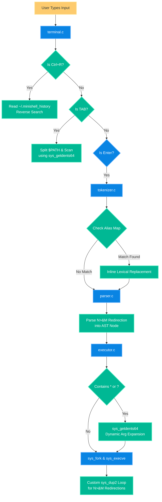
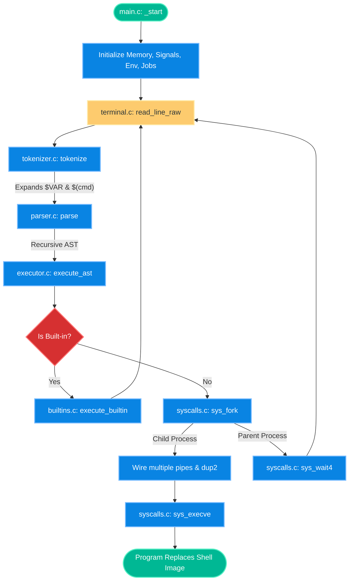
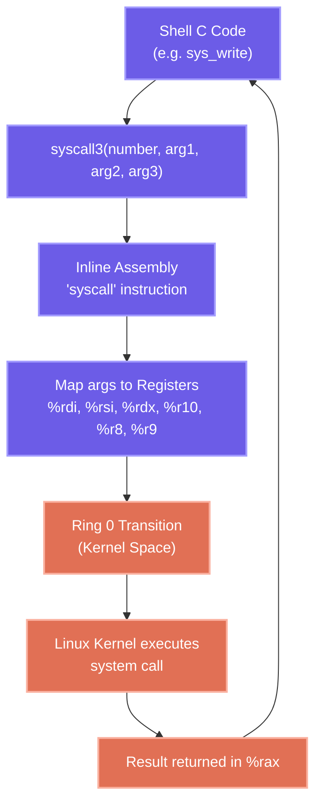
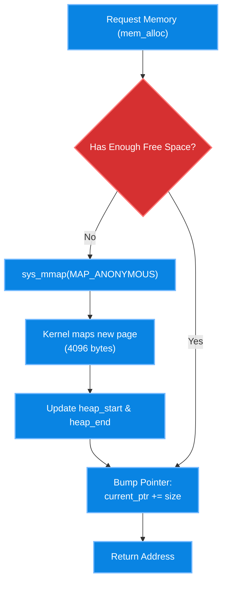
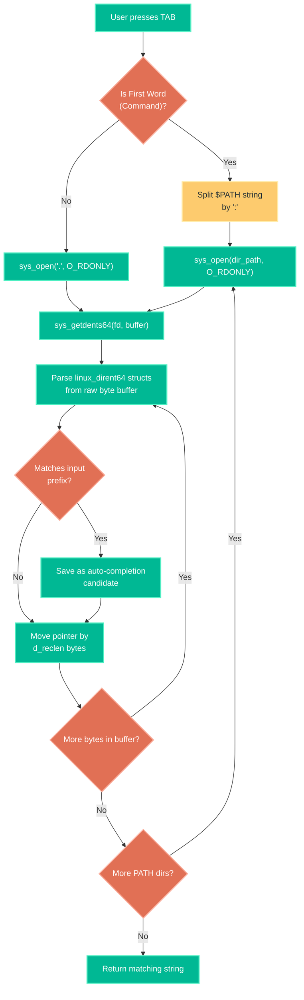
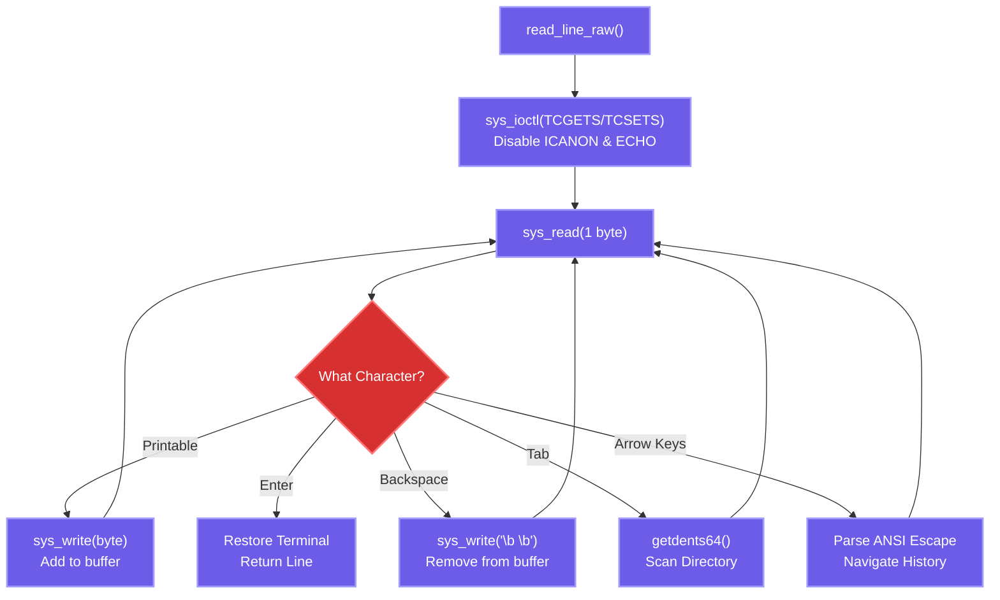
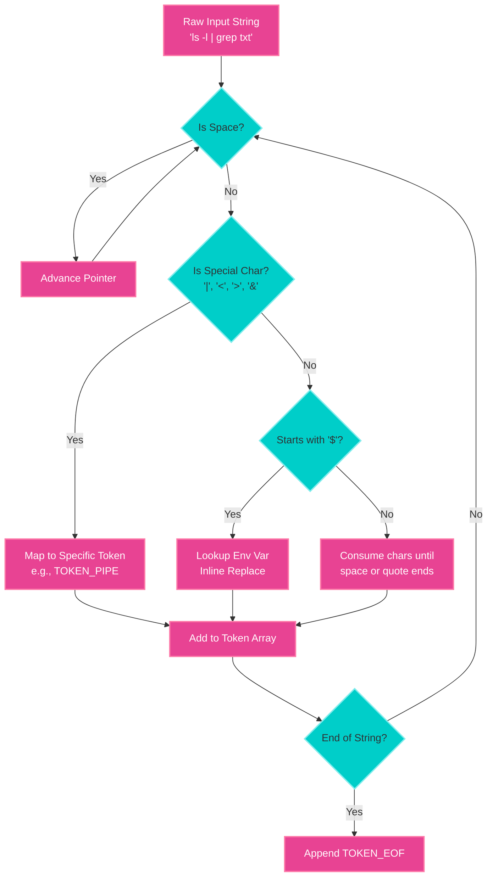
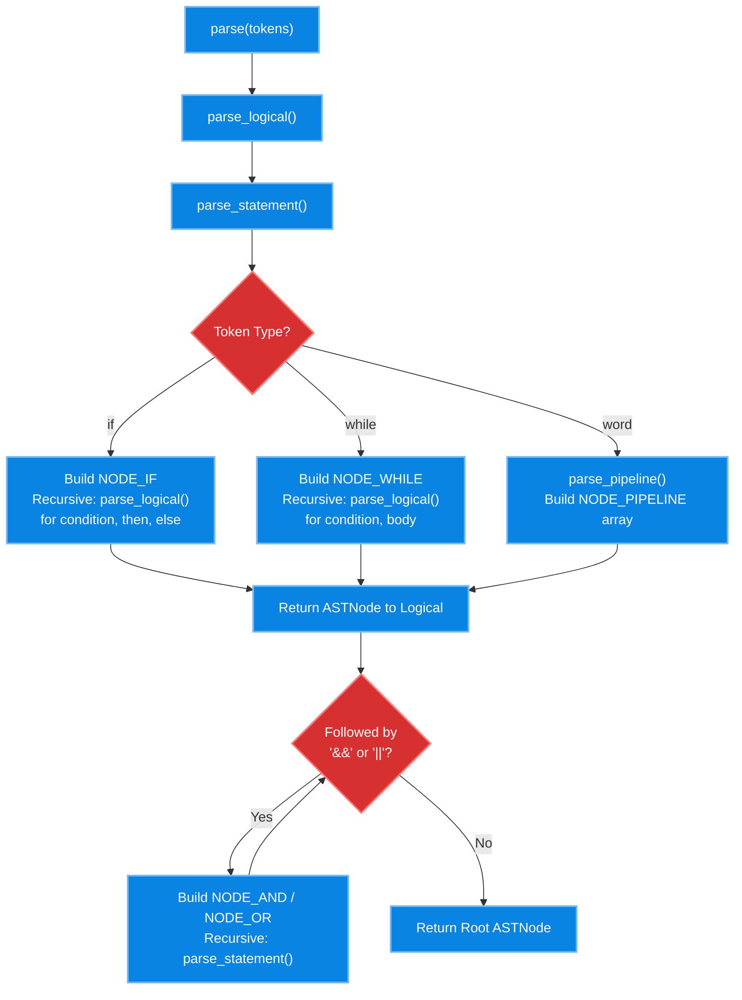
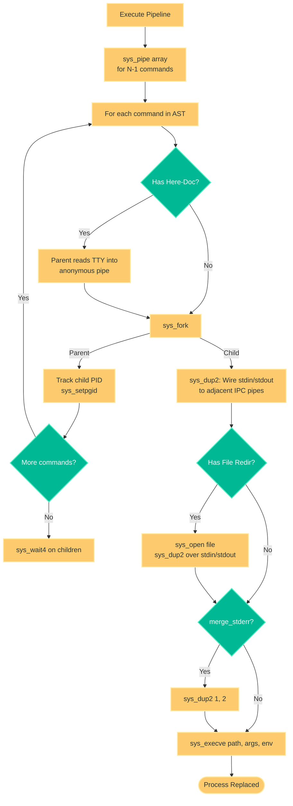
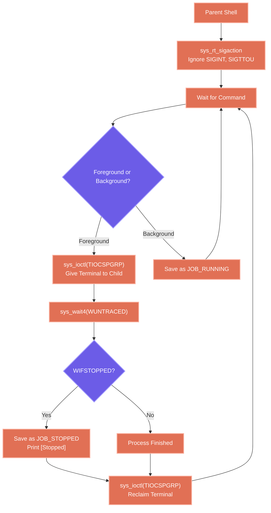

# Zero libc POSIX Shell

This project is a minimal, bare-metal POSIX shell built entirely from scratch without utilizing the standard C library (`libc`). It interacts with the Linux kernel directly by invoking software interrupts (system calls) via inline assembly.

This is a true systems programming project. It bypasses high-level wrappers like `system()`, `popen()`, or `<unistd.h>`, making it a living reference for Linux systems programmers to understand the underlying mechanics of process creation, Inter-Process Communication (IPC), memory allocation, and TTY driver control.

---

## ✨ Advanced Features

* **Persistent History & Reverse Search (`Ctrl+R`)**: Command history is saved to `~/.minishell_history` using raw `sys_open`/`sys_read`/`sys_write`. A live interactive reverse-i-search is built directly into the raw TTY terminal driver!
* **$PATH Auto-Completion**: Pressing `TAB` on the first word of a command dynamically searches all directories in your `$PATH` using `sys_getdents64` to provide live executable autocompletion.
* **Wildcard Globbing (`*`, `?`)**: A custom recursive regex-like glob matching engine built entirely from scratch expands wildcards before passing arguments to `sys_execve`.
* **Custom Aliases**: Supports `alias name=value` and `unalias name`. The tokenizer recursively expands aliases inline during lexical analysis before the AST is built!
* **Generalized FD Redirection (`N>&M`)**: Lexes and parses complex file descriptor duplications, utilizing an array of custom `sys_dup2` routings in the execution engine.

---

## 🏗️ Architecture & Flow Diagram

The shell operates through a standard Read-Eval-Print Loop (REPL), breaking down raw text into actionable system processes.

---

## 📁 Deep Dive into File Structure & Functions

Because we lack `libc`, this project is highly modular, reimplementing many fundamental OS interfaces and C primitives from the ground up.

### 1. Build System & Entry Point

* **`Makefile`**: 
  The compiler configuration. It uses `-nostdlib`, `-static`, and `-fno-builtin` flags to ensure the compiler generates a freestanding binary without linking the standard C runtime (`crt0` or `glibc`).
* **`src/main.c`**: 
  Contains the `_start` symbol, which the kernel directly jumps to when executing the binary.
  - **Function**: Manually parses the raw CPU stack pointer (`%rsp`) to extract `argc`, `argv`, and the initial `envp` (environment pointer). It calls all initialization routines and then loops indefinitely to power the shell's REPL.

### 2. Linux Kernel Interface (The Primitives)

* **`src/syscalls.h` & `src/syscalls.c`**: 
  The core of the "zero libc" implementation.
  - **Function**: Uses `x86_64` inline assembly to trigger software interrupts via the `syscall` instruction. It maps C function arguments into the specific CPU registers the Linux kernel demands (`%rdi`, `%rsi`, `%rdx`, `%r10`, etc.).
  - **Provides**: Wrappers for `sys_read`, `sys_write`, `sys_open`, `sys_pipe`, `sys_dup2`, `sys_fork`, `sys_execve`, `sys_wait4`, `sys_mmap`, `sys_ioctl`, and `sys_rt_sigaction`.

* **`src/memory.h` & `src/memory.c`**: 
  A custom memory allocator replacing `malloc`/`free`.
  - **Function**: Uses `sys_mmap` with `MAP_ANONYMOUS` to request a raw 16MB page of memory directly from the OS. It implements a rapid "bump pointer" allocator (`mem_alloc`) to dole out dynamic memory chunks to the shell.

* **`src/dirent.h` & `src/dirent.c`**:
  Raw Directory Parsing.
  - **Function**: Uses the `sys_getdents64` system call to bypass `libc`'s `opendir` and read the raw binary filesystem structures (`linux_dirent64`) directly from the kernel into a memory buffer. This allows the shell to match prefixes for TAB autocompletion.

* **`src/string_utils.h` & `src/string_utils.c`**: 
  Replaces `<string.h>`.
  - **Function**: Implements lightweight equivalents of `strlen`, `strcmp`, `strncmp`, `memcpy`, and `memset` necessary for text processing. Also includes a custom integer-to-string formatting routine since `printf` is unavailable.

### 3. Advanced Terminal & Environment Management

* **`src/terminal.h` & `src/terminal.c`**: 
  A low-level terminal (TTY) driver.
  - **Function**: Replaces the standard `read()` loop. It uses the `sys_ioctl` system call to strip the terminal of its default canonical mode (line-buffering), forcing it into **Raw Mode**.
  - **Features**: This allows the shell to intercept individual keystrokes. It parses multi-byte ANSI escape sequences (e.g., `\e[A`) for Up/Down Arrow keys (Command History), and it hooks the `TAB` key into `src/dirent.c` to provide live inline autocompletion for files in the current directory!

* **`src/env.h` & `src/env.c`**: 
  A dynamic environment variable manager.
  - **Function**: Captures the initial environment block from the kernel stack and copies it into our custom memory allocator. It exposes `get_env_val` and `set_env_val` so variables can be modified and expanded safely, eventually passing the customized array down to child processes.

### 4. The Shell Pipeline (Parsing & Execution)

* **`src/tokenizer.h` & `src/tokenizer.c`**: 
  The Lexical Analyzer.
  - **Function**: Scans the raw user input character by character and groups them into logical `Token` structures.
  - **Features**: Detects standard words, pipes (`|`), standard input/output redirections (`<`, `>`, `>>`), background flags (`&`), logical operators (`&&`, `||`), control keywords (`if`, `while`), **stderr merging** (`2>&1`), **Command Substitution** (`$(cmd)`), and **Here-Documents** (`<<`). It also detects the `$` prefix to immediately perform **Variable Expansion** against the dynamic environment.

* **`src/parser.h` & `src/parser.c`**: 
  The Recursive Descent AST Generator.
  - **Function**: Sweeps through the tokens to construct a true Abstract Syntax Tree (AST) using a temporary bump-pointer arena (`mem_alloc_temp`). 
  - **Features**: It recursively parses logical chains (`&&`, `||`), conditionals (`if/then/else/fi`), loops (`while/do/done`), and terminal pipelines. 

* **`src/executor.h` & `src/executor.c`**: 
  The Turing-Complete Execution Engine.
  - **Function**: Recursively traverses the AST. Evaluates condition nodes (e.g. `if`, `while`) by extracting the `WEXITSTATUS` from `sys_wait4`, and conditionally executes `then` or `else` branches.
  - **Advanced I/O**: For Here-Documents (`<<`), the shell dynamically spins up an anonymous pipe, takes over the terminal to read lines of text until the specified delimiter is reached, and securely pipes that data into the child process.
  - **Wiring**: For each command, it triggers `sys_fork()`. Inside the child process, it uses `sys_dup2` to meticulously stitch together standard inputs and outputs to the previously created pipes or file redirections. 

### 5. Process Control & Builtins

* **`src/builtins.h` & `src/builtins.c`**: 
  State-modifying shell commands.
  - **Function**: Executes commands that must run inside the parent shell process (since a child cannot change the parent's environment). Supports `cd` (using the `chdir` syscall), `exit`, `env`, `export`, `jobs`, `fg`, and `bg`.
* **`src/signals.h` & `src/signals.c`**: 
  POSIX Signal Handling.
  - **Function**: Constructs a kernel `k_sigaction` struct and registers it via `sys_rt_sigaction`. It explicitly tells the kernel to ignore (`SIG_IGN`) `SIGINT` (Ctrl+C), `SIGQUIT` (Ctrl+\), and job control signals (`SIGTTOU`, `SIGTTIN`, `SIGTSTP`) for the parent shell. This ensures you don't accidentally kill or suspend the shell when interacting with a foreground job. Child processes have their signals reset (`SIG_DFL`) before execution.
* **`src/jobs.h` & `src/jobs.c`**: 
  True Job Control & Process Groups.
  - **Function**: Manages the complex state of foreground and background jobs. It assigns processes to distinct Process Groups (`sys_setpgid`) and explicitly hands over terminal control (`sys_ioctl` with `TIOCSPGRP`) to foreground jobs.
  - **Features**: This allows you to press `Ctrl+Z` to suspend a running process (`SIGTSTP`), track it in the background using the `jobs` command, and resume it in the foreground using `fg 1` (sending `SIGCONT`). Background "zombie" processes are cleanly reaped using a non-blocking `sys_wait4` call (`WNOHANG | WUNTRACED`).

---

## 🚀 How to Compile & Run

1. Open a Linux environment (or WSL on Windows).
2. Run `make` to compile the statically linked, zero-libc binary.
3. Run `./tests.sh` to execute the automated POSIX compliance tests.
4. Run `./minishell` to launch the REPL and interact with it (Try testing pipes, redirection, `$PATH` expansion, and the Up-Arrow history!).
